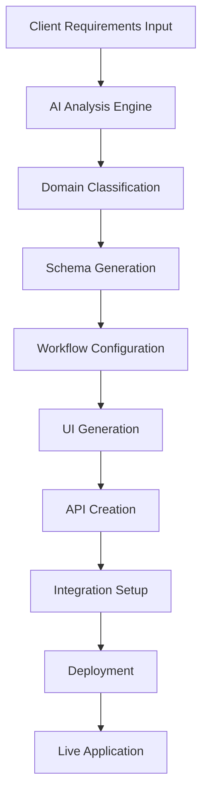

# Universal Lead Management Platform Template
## Product Requirements Document (PRD)

**Version**: 1.0  
**Date**: October 1, 2025  
**Status**: Draft  

---

## Executive Summary

### Vision Statement
Create a comprehensive, AI-powered, multi-tenant lead management platform template that can be rapidly customized and deployed for any industry domain with zero-code configuration capabilities.

### Mission
Empower businesses across all industries to manage leads effectively through an intelligent, adaptable platform that automatically generates domain-specific applications with AI-driven insights and automation.

### Key Value Propositions
- **Universal Adaptability**: One platform, infinite industries
- **AI-Powered Automation**: Intelligent lead scoring, assignment, and insights
- **Zero-Code Customization**: Configure without coding
- **Multi-Tenant Architecture**: Serve multiple clients on one instance
- **Rapid Deployment**: From requirements to live app in hours, not months

---

## Product Overview

### Target Markets
- **Primary**: Software vendors, consultants, and agencies serving SMBs
- **Secondary**: Enterprise clients needing custom lead management solutions
- **Tertiary**: SaaS companies offering white-label solutions

### Supported Industries
- Healthcare & Medical Services
- Real Estate & Property Management
- Financial Services & Insurance
- Education & Training
- SaaS & Technology
- Manufacturing & B2B Services
- Hospitality & Travel
- Legal Services
- Non-Profit Organizations
- **Any industry with lead generation needs**

---

## Core Architecture

### 1. Multi-Tenant Foundation
```
┌─────────────────────────────────────────────────────────────┐
│                    Platform Management Layer                │
├─────────────────────────────────────────────────────────────┤
│  Tenant A     │   Tenant B      │   Tenant C     │  Tenant N │
│  (Healthcare) │   (Real Estate) │   (Education)  │  (Custom)  │
├─────────────────────────────────────────────────────────────┤
│              Shared Infrastructure & Services                │
└─────────────────────────────────────────────────────────────┘
```

**Tenant Isolation Options**:
- **Database Level**: Separate MongoDB databases per tenant
- **Schema Level**: Shared database with tenant-specific collections
- **Row Level**: Shared collections with tenant_id filtering

**White-Labeling Support**:
- Custom branding (logos, colors, themes)
- Custom domain mapping
- Tenant-specific email templates
- Branded mobile apps (PWA support)

### 2. AI-Powered Application Generator

#### Auto-App Creation Workflow


#### AI Application Generator Features
- **Requirements Parser**: Natural language processing of client needs
- **Domain Detection**: Automatic industry classification and best practices
- **Schema Generator**: AI-generated data models based on domain
- **Workflow Builder**: Industry-specific lead management flows
- **UI Generator**: Contextual interface creation
- **Integration Recommender**: Suggest relevant third-party integrations

---

## Functional Requirements

### 1. Dynamic Data Model System

#### Custom Field Engine
```typescript
interface CustomField {
  id: string;
  name: string;
  displayName: string;
  fieldType: 'text' | 'number' | 'date' | 'dropdown' | 'multiselect' | 
             'checkbox' | 'radio' | 'textarea' | 'email' | 'phone' | 
             'url' | 'file' | 'image' | 'json' | 'location';
  required: boolean;
  validation: ValidationRule[];
  options?: DropdownOption[]; // For dropdown/multiselect
  defaultValue?: any;
  category: string;
  displayOrder: number;
  conditionalLogic?: ConditionalRule[];
}

interface LeadSchema {
  tenantId: string;
  domain: string;
  coreFields: CoreField[];
  customFields: CustomField[];
  relationships: Relationship[];
  businessRules: BusinessRule[];
}
```

#### Core Universal Fields
- **Identity**: Name, Email, Phone, Company
- **Source**: Origin channel, campaign, referrer
- **Classification**: Lead type (hot/warm/cold), score, stage
- **Timestamps**: Created, updated, last contacted
- **Assignment**: Owner, team, territory
- **Status**: Current state, substatus, lifecycle stage

#### Domain-Specific Extensions
- **Healthcare**: Patient info, insurance, medical history, appointment preferences
- **Real Estate**: Property interests, budget range, financing, location preferences
- **Education**: Course interests, enrollment dates, education level, demographics
- **Financial**: Investment goals, risk tolerance, assets, income level

### 2. Lead Source Management

#### Omnichannel Lead Capture
```
┌─────────────────────────────────────────────────────────────┐
│                    Lead Ingestion Hub                       │
├─────────────────────────────────────────────────────────────┤
│  Web Forms  │  Landing Pages │   API Endpoints  │  Webhooks │
│  Chatbots   │  Social Media  │   Email Capture  │  Phone    │
│  Events     │  Referrals     │   Direct Entry   │  CSV/Bulk │
├─────────────────────────────────────────────────────────────┤
│              Deduplication & Enrichment Engine              │
├─────────────────────────────────────────────────────────────┤
│                    Lead Distribution                        │
└─────────────────────────────────────────────────────────────┘
```

#### Social Media Integrations
- **Facebook Lead Ads**: Automatic lead import
- **LinkedIn Lead Gen**: Professional lead capture
- **Instagram/TikTok**: Social commerce leads
- **Twitter/X**: Engagement-based lead identification
- **YouTube**: Video marketing leads
- **WhatsApp Business**: Conversational lead capture

#### Form Builder
- **Drag-and-Drop Interface**: Visual form creation
- **Smart Field Suggestions**: AI-recommended fields by domain
- **Progressive Profiling**: Gradual information collection
- **Conditional Logic**: Dynamic form behavior
- **Multi-Step Forms**: Improved conversion rates
- **A/B Testing**: Form optimization

### 3. AI-Powered Lead Intelligence

#### Lead Scoring Engine
```python
class AILeadScoringEngine:
    def __init__(self, domain_config):
        self.models = {
            'demographic_score': DemographicScoringModel(),
            'behavioral_score': BehavioralScoringModel(),
            'engagement_score': EngagementScoringModel(),
            'intent_score': IntentAnalysisModel(),
            'fit_score': IdealCustomerProfileModel()
        }
    
    def calculate_composite_score(self, lead_data):
        scores = {}
        for model_name, model in self.models.items():
            scores[model_name] = model.predict(lead_data)
        
        return self.weighted_combination(scores)
```

#### AI Features by Domain

**Healthcare**:
- **Appointment Likelihood**: Predict scheduling probability
- **Treatment Interest**: Analyze service preferences
- **Insurance Compatibility**: Match with accepted plans
- **Urgency Detection**: Identify time-sensitive cases

**Real Estate**:
- **Buying Readiness**: Assess purchase timeline
- **Price Range Optimization**: Suggest property matches
- **Market Timing**: Predict best contact windows
- **Mortgage Pre-qualification**: Likelihood scoring

**Education**:
- **Enrollment Probability**: Course signup likelihood
- **Program Fit**: Match students to programs
- **Financial Aid Needs**: Scholarship/aid prediction
- **Retention Risk**: Early warning system

**Financial Services**:
- **Investment Readiness**: Portfolio analysis
- **Risk Assessment**: Client risk profiling
- **Product Matching**: Service recommendations
- **Compliance Screening**: Regulatory compliance

#### Predictive Analytics
- **Conversion Probability**: Likelihood to close
- **Optimal Contact Time**: Best engagement windows
- **Channel Preference**: Preferred communication method
- **Churn Risk**: Early warning indicators
- **Lifetime Value**: Revenue potential prediction

### 4. Workflow Automation Engine

#### Visual Workflow Builder
```
Start → Lead Created → AI Scoring → Route Decision → Assignment → 
Follow-up → Nurturing → Qualification → Conversion → Post-Sale
```

#### Configurable Stages
- **Domain-Specific Templates**: Pre-built workflows by industry
- **Custom Stage Creation**: Unlimited custom stages
- **Stage Automation**: Trigger-based advancement
- **Parallel Workflows**: Multiple concurrent processes
- **Approval Gates**: Management review points

#### Assignment Rules Engine
```yaml
assignment_rules:
  - name: "Geographic Assignment"
    conditions:
      - field: "location"
        operator: "within_radius"
        value: "50_miles"
    actions:
      - assign_to: "territory_owner"
  
  - name: "Product Specialization"
    conditions:
      - field: "product_interest"
        operator: "equals"
        value: "enterprise_software"
    actions:
      - assign_to: "enterprise_team"
      - set_priority: "high"
```

#### Escalation Management
- **Time-Based Escalation**: Auto-escalate after inactivity
- **Score-Based Escalation**: High-value lead prioritization
- **Custom Escalation Rules**: Flexible trigger conditions
- **Multi-Level Escalation**: Hierarchical routing
- **De-escalation Logic**: Automatic down-grading

### 5. Communication & Engagement Hub

#### Multi-Channel Communication
- **Email Sequences**: Automated drip campaigns
- **SMS Marketing**: Text-based engagement
- **Voice Calling**: Click-to-call integration
- **Video Meetings**: Embedded scheduling
- **Chat Systems**: Live chat and chatbots
- **Social Messaging**: WhatsApp, Facebook Messenger

#### AI-Powered Content Generation
- **Personalized Emails**: Dynamic content creation
- **Response Suggestions**: AI-assisted replies
- **Content Optimization**: A/B testing recommendations
- **Language Adaptation**: Multi-language support
- **Sentiment Analysis**: Communication tone optimization

---

## Technical Architecture

### 1. Core Technology Stack

#### Backend Architecture
```
┌─────────────────────────────────────────────────────────────┐
│                    API Gateway (FastAPI)                   │
├─────────────────────────────────────────────────────────────┤
│  Auth Service │ Lead Service │ AI Service │ Integration Hub │
├─────────────────────────────────────────────────────────────┤
│              Message Queue (Redis/RabbitMQ)                │
├─────────────────────────────────────────────────────────────┤
│  MongoDB      │  PostgreSQL  │  ClickHouse │  Vector DB    │
│  (Documents)  │  (Relations) │  (Analytics)│  (AI/ML)      │
└─────────────────────────────────────────────────────────────┘
```

#### Frontend Architecture
```
┌─────────────────────────────────────────────────────────────┐
│            Admin Portal (React + TypeScript)               │
├─────────────────────────────────────────────────────────────┤
│         Client Applications (Multi-tenant)                 │
│  React Dashboard │ Mobile PWA │ Embedded Widgets           │
├─────────────────────────────────────────────────────────────┤
│              Shared Component Library                      │
└─────────────────────────────────────────────────────────────┘
```

#### AI/ML Stack
- **Model Serving**: TensorFlow Serving, PyTorch Serve
- **Feature Store**: Feast or custom Redis-based
- **Experiment Tracking**: MLflow or Weights & Biases
- **Vector Database**: Pinecone, Weaviate, or Chroma
- **NLP Processing**: OpenAI GPT, Anthropic Claude
- **Computer Vision**: For document/image processing

### 2. Microservices Architecture

```
┌─────────────────────────────────────────────────────────────┐
│                     Core Services                          │
├─────────────────────────────────────────────────────────────┤
│ • Tenant Management    • User Management (RBAC)            │
│ • Schema Management    • Lead Management                    │
│ • Workflow Engine      • Communication Service             │
│ • Integration Hub      • Analytics Engine                  │
│ • AI/ML Service        • Notification Service              │
│ • File Storage         • Audit Service                     │
└─────────────────────────────────────────────────────────────┘
```

### 3. Data Architecture

#### Multi-Tenant Data Strategy
```sql
-- Option 1: Database per tenant
tenant_001_db
  ├── leads
  ├── users
  ├── workflows
  └── custom_data

-- Option 2: Schema per tenant  
shared_db
  ├── tenant_001_leads
  ├── tenant_001_users
  ├── tenant_002_leads
  └── tenant_002_users

-- Option 3: Row-level security
shared_collections
  ├── leads {tenant_id, ...}
  ├── users {tenant_id, ...}
  └── workflows {tenant_id, ...}
```

#### Data Models
```typescript
// Core Lead Model
interface UniversalLead {
  id: string;
  tenant_id: string;
  
  // Core fields
  contact_info: ContactInfo;
  source_info: SourceInfo;
  classification: LeadClassification;
  assignment: AssignmentInfo;
  
  // Dynamic fields
  custom_fields: Record<string, any>;
  
  // System fields
  created_at: Date;
  updated_at: Date;
  created_by: string;
  last_activity: Date;
  
  // AI fields
  ai_score: number;
  ai_insights: AIInsight[];
  predicted_value: number;
  engagement_score: number;
}

// Tenant Configuration
interface TenantConfig {
  id: string;
  domain: string;
  branding: BrandingConfig;
  schema: LeadSchema;
  workflows: WorkflowConfig[];
  integrations: IntegrationConfig[];
  ai_settings: AIConfig;
  business_rules: BusinessRule[];
}
```

---

## AI Integration Strategy

### 1. Application Generation AI

#### Requirements Processing Pipeline
```python
class ApplicationGenerator:
    def __init__(self):
        self.domain_classifier = DomainClassifier()
        self.schema_generator = SchemaGenerator()
        self.workflow_builder = WorkflowBuilder()
        self.ui_generator = UIGenerator()
    
    async def generate_application(self, requirements: str):
        # Parse natural language requirements
        parsed_req = await self.parse_requirements(requirements)
        
        # Classify domain and suggest configurations
        domain_config = await self.domain_classifier.classify(parsed_req)
        
        # Generate data schema
        schema = await self.schema_generator.create_schema(
            domain_config, parsed_req
        )
        
        # Build workflows
        workflows = await self.workflow_builder.create_workflows(
            domain_config, schema
        )
        
        # Generate UI components
        ui_config = await self.ui_generator.create_interface(
            schema, workflows, domain_config
        )
        
        return ApplicationConfig(
            schema=schema,
            workflows=workflows,
            ui_config=ui_config,
            integrations=domain_config.recommended_integrations
        )
```

#### Domain-Specific AI Suggestions

**Healthcare Application**:
```json
{
  "suggested_fields": [
    {"name": "insurance_provider", "type": "dropdown", "required": true},
    {"name": "medical_condition", "type": "multiselect", "required": false},
    {"name": "preferred_appointment_time", "type": "datetime", "required": true}
  ],
  "suggested_workflows": [
    {"name": "appointment_booking", "stages": ["inquiry", "screening", "scheduling", "confirmation"]},
    {"name": "insurance_verification", "automated": true}
  ],
  "suggested_integrations": [
    {"service": "electronic_health_records", "priority": "high"},
    {"service": "appointment_scheduling", "priority": "high"},
    {"service": "insurance_verification", "priority": "medium"}
  ],
  "ai_features": [
    {"name": "appointment_likelihood_prediction", "description": "Predict patient show-up probability"},
    {"name": "treatment_recommendation", "description": "Suggest appropriate treatments based on symptoms"},
    {"name": "urgent_case_detection", "description": "Identify time-sensitive medical cases"}
  ]
}
```

### 2. Intelligent Lead Processing

#### AI-Powered Features
- **Lead Enrichment**: Automatic data completion from external sources
- **Duplicate Detection**: ML-based lead deduplication
- **Intent Recognition**: NLP analysis of lead communications
- **Optimal Timing**: Predictive contact time optimization
- **Content Personalization**: Dynamic message customization
- **Conversation Analysis**: Meeting transcription and insights

#### Machine Learning Models
```python
# Lead Scoring Model
class UniversalLeadScoringModel:
    def __init__(self, domain: str):
        self.domain = domain
        self.models = self.load_domain_models()
    
    def score_lead(self, lead_data: dict) -> LeadScore:
        features = self.extract_features(lead_data)
        
        scores = {
            'demographic': self.models['demographic'].predict(features),
            'behavioral': self.models['behavioral'].predict(features),
            'contextual': self.models['contextual'].predict(features),
            'temporal': self.models['temporal'].predict(features)
        }
        
        composite_score = self.combine_scores(scores)
        confidence = self.calculate_confidence(scores)
        
        return LeadScore(
            total_score=composite_score,
            confidence=confidence,
            component_scores=scores,
            recommendations=self.generate_recommendations(scores)
        )
```

---

## Integration Ecosystem

### 1. Communication Platforms
- **Email**: SendGrid, Mailgun, Amazon SES, Outlook
- **SMS**: Twilio, Vonage, Amazon SNS
- **Voice**: Twilio Voice, RingCentral, Zoom Phone
- **Chat**: Intercom, Zendesk Chat, Drift, Crisp
- **Social**: Facebook, LinkedIn, Twitter, Instagram APIs
- **Messaging**: WhatsApp Business, Telegram, Slack, Teams

### 2. Marketing & Sales Tools
- **CRM Integration**: Salesforce, HubSpot, Pipedrive, Zoho
- **Marketing Automation**: Mailchimp, Pardot, Marketo, ActiveCampaign
- **Analytics**: Google Analytics, Mixpanel, Amplitude, Segment
- **Ad Platforms**: Google Ads, Facebook Ads, LinkedIn Ads
- **Landing Pages**: Unbounce, Leadpages, Instapage

### 3. Business Intelligence & Reporting
- **BI Tools**: Tableau, Power BI, Looker, Metabase
- **Data Warehouses**: Snowflake, BigQuery, Redshift
- **ETL Platforms**: Fivetran, Stitch, Airbyte
- **Custom Dashboards**: Built-in analytics with AI insights

### 4. Industry-Specific Integrations

#### Healthcare
- **EHR Systems**: Epic, Cerner, Allscripts, athenahealth
- **Practice Management**: SimplePractice, TherapyNotes, drchrono
- **Insurance**: Eligibility verification APIs
- **Appointment Scheduling**: Calendly, Acuity, BookingBug

#### Real Estate
- **MLS Integration**: Regional MLS systems
- **Property Data**: Zillow, Realtor.com APIs
- **Document Management**: DocuSign, PandaDoc
- **Mortgage**: Lending platforms integration

#### Financial Services
- **KYC/AML**: Jumio, Onfido, Thomson Reuters
- **Credit Scoring**: Experian, TransUnion, Equifax
- **Portfolio Management**: Trading platforms
- **Compliance**: RegTech solutions

---

## User Experience & Interface Design

### 1. Multi-Level Admin Interface

#### Super Admin Dashboard
- **Tenant Management**: Create, configure, monitor tenants
- **Platform Analytics**: Usage metrics, performance monitoring
- **AI Model Management**: Training, deployment, monitoring
- **Integration Marketplace**: Available integrations catalog
- **White-Label Configuration**: Branding and customization tools

#### Tenant Admin Dashboard
- **App Configuration**: Schema design, workflow setup
- **User Management**: RBAC, team organization
- **Integration Setup**: Third-party connections
- **Analytics & Reporting**: Tenant-specific insights
- **AI Configuration**: Model settings, automation rules

#### End User Interface
- **Lead Dashboard**: Pipeline view, activity feeds
- **Lead Details**: Comprehensive lead profiles
- **Task Management**: Follow-up activities, reminders
- **Communication Hub**: Multi-channel messaging
- **Analytics**: Personal performance metrics

### 2. Mobile Experience
- **Progressive Web App**: Native-like mobile experience
- **Offline Capability**: Local data synchronization
- **Push Notifications**: Real-time alerts
- **Mobile-Optimized Forms**: Touch-friendly lead capture
- **GPS Integration**: Location-based lead routing

### 3. AI-Powered User Experience
- **Smart Suggestions**: AI-recommended actions
- **Conversational Interface**: Natural language queries
- **Predictive Search**: Intelligent lead discovery
- **Automated Insights**: Proactive recommendations
- **Voice Interface**: Hands-free operation

---

## Implementation Phases

### Phase 1: Core Platform Foundation (Months 1-3)
**Objectives**: Build the essential multi-tenant architecture and basic lead management

**Deliverables**:
- Multi-tenant infrastructure with database isolation
- Basic RBAC system (from existing funds-trackon system)
- Core lead management (CRUD operations)
- Basic workflow engine
- RESTful API foundation
- Admin interface for tenant management

**Key Features**:
- Tenant onboarding and configuration
- User management with role-based access
- Basic lead capture and storage
- Simple pipeline management
- Data export/import capabilities

### Phase 2: Dynamic Configuration System (Months 4-6)
**Objectives**: Enable zero-code customization and schema flexibility

**Deliverables**:
- Dynamic schema builder
- Custom field engine
- Visual workflow designer
- Form builder interface
- Basic integration framework
- Template marketplace

**Key Features**:
- Drag-and-drop form builder
- Custom field definitions with validation
- Workflow automation rules
- Integration API framework
- Domain-specific templates
- White-labeling capabilities

### Phase 3: AI Integration & Intelligence (Months 7-9)
**Objectives**: Add AI-powered features and intelligent automation

**Deliverables**:
- AI application generator
- Lead scoring engine
- Predictive analytics
- Natural language processing
- Automated insights
- Smart recommendations

**Key Features**:
- Requirements-to-app AI generator
- Intelligent lead scoring and routing
- Predictive contact timing
- Automated lead enrichment
- Conversation analysis
- Performance optimization suggestions

### Phase 4: Advanced Integrations & Marketplace (Months 10-12)
**Objectives**: Build comprehensive integration ecosystem

**Deliverables**:
- Integration marketplace
- Advanced communication tools
- Industry-specific modules
- Advanced analytics platform
- Mobile applications
- API ecosystem

**Key Features**:
- 50+ pre-built integrations
- Advanced reporting and BI tools
- Industry-specific AI models
- Mobile PWA and native apps
- Developer API platform
- Marketplace for third-party extensions

### Phase 5: Enterprise & Scale Features (Months 13-15)
**Objectives**: Enterprise-grade features and performance optimization

**Deliverables**:
- Advanced security features
- Performance optimization
- Enterprise integrations
- Advanced AI capabilities
- Global deployment
- Comprehensive documentation

**Key Features**:
- SOC 2 compliance
- Advanced audit logging
- Multi-region deployment
- Advanced AI model training
- Enterprise SSO integration
- 24/7 support infrastructure

---

## Success Metrics & KPIs

### Platform Metrics
- **Time to Deploy**: Average time from requirements to live application
- **Customization Adoption**: Percentage of tenants using custom configurations
- **Integration Usage**: Most popular integrations by domain
- **User Satisfaction**: NPS scores from tenant administrators
- **Platform Uptime**: 99.9% availability target

### Business Metrics
- **Tenant Growth**: Monthly recurring revenue and tenant acquisition
- **Lead Conversion**: Average improvement in conversion rates
- **User Productivity**: Time saved through automation
- **Market Coverage**: Number of industries successfully served
- **AI Accuracy**: Lead scoring and prediction accuracy rates

### Technical Metrics
- **API Performance**: Response times and throughput
- **Data Processing**: Lead ingestion and processing speeds
- **AI Model Performance**: Prediction accuracy and bias metrics
- **Security**: Zero security incidents, vulnerability response times
- **Scalability**: Concurrent user capacity and data volume handling

---

## Risk Assessment & Mitigation

### Technical Risks
- **Complexity Management**: Modular architecture and comprehensive testing
- **Performance at Scale**: Horizontal scaling and caching strategies
- **Data Security**: Encryption, access controls, and regular audits
- **AI Bias**: Diverse training data and bias detection mechanisms
- **Integration Failures**: Robust error handling and fallback mechanisms

### Business Risks
- **Market Competition**: Rapid development cycles and unique AI features
- **Customer Churn**: Strong onboarding and support processes
- **Regulatory Changes**: Compliance monitoring and adaptive architecture
- **Technology Obsolescence**: Continuous technology evaluation and updates
- **Resource Constraints**: Phased development and strategic partnerships

### Mitigation Strategies
- **Technical**: Comprehensive testing, monitoring, and disaster recovery
- **Business**: Customer success programs, flexible pricing, and market research
- **Legal**: Regular compliance reviews and legal consultation
- **Financial**: Diversified revenue streams and cost optimization
- **Operational**: Cross-functional teams and knowledge documentation

---

## Appendices

### A. Technical Specifications
- Database schemas and relationships
- API endpoint documentation
- Security protocols and compliance requirements
- Performance benchmarks and optimization guidelines
- Deployment architecture and infrastructure requirements

### B. Domain-Specific Configurations
- Healthcare lead management templates
- Real estate pipeline configurations
- Financial services compliance requirements
- Education enrollment management
- SaaS trial-to-paid conversion funnels

### C. Integration Specifications
- OAuth 2.0 and API authentication protocols
- Webhook payload formats and retry mechanisms
- Data synchronization strategies
- Error handling and logging standards
- Rate limiting and throttling policies

### D. AI Model Documentation
- Lead scoring algorithm specifications
- Natural language processing capabilities
- Computer vision for document analysis
- Recommendation engine architectures
- Bias detection and mitigation strategies

---

*This PRD serves as the foundation for building a universal, AI-powered lead management platform that can be rapidly customized for any industry while maintaining enterprise-grade security, performance, and scalability.*